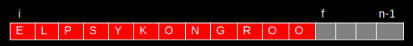
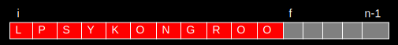

# Filas

Filas são estruturas de dados que seguem o princípio FIFO (First In, First Out), ou seja, o primeiro elemento a entrar é o primeiro a sair.

## Operações

- `fila = criar_fila()`: Cria uma fila vazia
- `enfileirar(fila, valor)`: Adiciona um elemento no final da fila
- `desenfileirar(fila)`: Remove o primeiro elemento da fila
- `fila_frente(fila)`: Retorna o primeiro elemento da fila
- `fila_tamanho(fila)`: Retorna o tamanho da fila
- `fila_vazia(fila)`: Verifica se a fila está vazia
- `fila_cheia(fila)`: Verifica se a fila está cheia (apenas em filas estáticas).

## Implementações

### Fila estática

Uma fila estática é uma fila que possui um tamanho máximo definido.

A forma mais direta de implementar uma fila estática seria utilizando um vetor com um início em 0 e um fim no tamanho máximo da fila:

Porém nesta forma de implementação acaba sendo custoso pois cada vez que um elemento é removido da fila, todos os elementos precisam ser deslocados para a esquerda.  

