# Ownership


_Ownership_ é um conceito importante em Rust. É o que permite que Rust ser _memory safe_ sem a necessidade de um _garbage collector_.

## Comportamentos Indefinidos

A base do Rust é evitar comportamentos indefinidos. Comportamentos indefinidos são comportamentos que podem ocorrer em tempo de execução, mas não são garantidos. Isso pode ocorrer por diversos motivos, como por exemplo, acessar um valor que não existe na memória. Por exemplo:

```C
//C code
int main() {
    int v[3] = {1, 2, 3};
    printf("%d\n", v[100]);
    return 0;
}
```

O código acima tenta acessar o valor na posição 100 do vetor `v`, mas como o vetor só tem 3 elementos, o valor na posição 100 não existe. O que acontece quando executamos esse código? Depende do compilador. O compilador pode decidir que o programa deve ser encerrado, ou pode decidir que o programa deve continuar executando, mas com um valor aleatório na posição 100 do vetor. Isso é um comportamento indefinido. Para evitar isso certas linguagens podem usar um _garbage collector_, que é um programa que roda junto com o programa principal e que é responsável por verificar se o programa está tentando acessar um valor que não existe na memória. Se o programa estiver tentando acessar um valor que não existe na memória, o _garbage collector_ encerra o programa.

No caso de Rust para evitar o uso de um _garbage collector_, que encontra o comportamento indefinido em _run-time_, Rust encontra o comportamento indefinido em _compile-time_. Por exemplo, o código abaixo não compila:

```Rust
fn main() {
    let v = vec![1, 2, 3];
    println!("{}", v[100]);
}
```

## Armazenamento em Rust

### Stack

_Stack_ é a parte da memória que armazena variáveis com tamanho conhecido em tempo de compilação. Neste esepaço a memória é alocada e desalocada seguindo uma ordem de _last-in-first-out_ (LIFO). Ou seja, a última variável a ser alocada é a primeira a ser desalocada. 

Um exemplo da forma que o Rust armazena na _stack_ é:

```Rust
fn main(){
      let n = 5;
      .
      .
      .
}
```
Neste _frame_ da _stack_ o valor `5` é armazenado na stack:

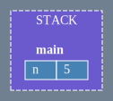


Observa-se que neste frame a variável `n` é armazenada dentro da _stack_ e no _frame_ da função `main`. Quando a função `main` termina de executar, o frame é desempilhado e a variável `n` é desalocada da memória.

Agora veremos o que ocorre quando chamamos uma função que vai utilizar o valor de `n`:

```rust
fn main() {
    let n = 5;
    ... = add_one(n);
    .
    .
    .
}

fn add_one(x: i32) -> i32 {
    x + 1
}
```

Assim vemos a _stack_ após a chamada da função `add_one`:

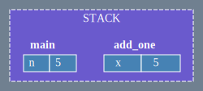

O valor de `n` é copiado para a função `add_one` e é armazenado no _frame_ da função `add_one`. Depois disso temos:

```rust
fn main() {
    let n = 5;
    let m = add_one(n);
    .
    .
    .
}

fn add_one(x: i32) -> i32 {
    x + 1
}
```


Assim o valor retornado pela função `add_one` é copiado para a variável `m` e é armazenado no _frame_ da função `main` e o  _frame_ da função `add_one` é desempilhado e a variável `x` é desalocada da memória. Já quando a função `main` termina de executar, o _frame_ da função `main` é desempilhado desalocando primeiro a variável `m` e depois a variável `n`.

No caso de expressões que leem uma variável e escrevem em outra, como por exemplo:

```rust
fn main() {
    let n = 5;
    let mut m = n;
    m += 1;
}
```

A Stack primeiro aloca o valor de `n`:


Depois aloca o valor de `m`, copiando ele em um novo espaço:

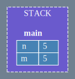

E, por isso, quando ele some da memória, o valor de `n` não é alterado:

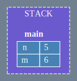

### _Heap_ e _Box_

A _heap_ é a parte da memória que armazena variáveis com tamanho desconhecido em tempo de compilação. Neste espaço a memória é alocada e desalocada de acordo com o tamanho da variável, independente da posição na memória. Isso permite que caso seja necessário, a memória possa ser realocada para um espaço maior.

Observando o seguinte exemplo:

```rust
fn main() {
    let n = [0;1_000_000];
    let m = n;
}
```

Neste exemplo estamos tentando **transferir** o conteúdo de `n` para `m`.
Sua alocação na _stack_ seria:

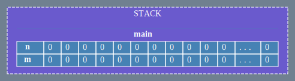

Isso obviamente seria muito custoso. Por isso, uma forma do Rust transferir o valor de uma variável para outra sem a necessidade de copiar uma grande quantidade de dados é utilizando um _pointer_ que aponta para o valor (chamado de _pointee_) alocado na _heap_. A é uma região separada da memória onde o dado pode ficar indefinidamente. Os dados da _heap_ não são ligados a um _frame_ especifíco da _stack_. No Rust o _construct_ `Box` é usado para alocar um valor na _heap_. Por exemplo:

```rust
fn main() {
    let n = Box::new([0; 1_000_000]); 
    let m = n;
}
```

Assim sua alocação ficaria:


Quando a _construct_ `Box` é criada ela aloca um espaço na _heap_ e retorna um _pointer_ (representado por ⏺) para esse espaço. Esse _pointer_ indica onde está o _pointee_ na _heap_. Já quando `let m = n;` é executado, o _pointer_ é copiado para a variável `m` e o _pointee_ não é copiado.

#### _Move_

No exemplo anterior ocorreu uma operação chamada _move_. _Move_ é quando a _ownership_ de um valor é transferida de uma variável para outra. Quando uma variável é movida para outra, a variável original não pode mais ser usada, assim:

```rust
fn main() {
    let n = Box::new([0; 1_000_000]); 
    let m = n;
}
```

Quando a declaração `let m = n;` é executada, não apenas o _pointer_ é copiado como a _ownership_ do _pointee_ é transferida para a variável `m`, por isso após a transferência dos dados de um _pointer_ pro outro, o compilador não permite acessar novamente o _pointee_ de `n`.


#### Desalocação

A partir desse exemplo, vamos observar como a memória vai ser desalocada:

```rust

fn main() {
    let n = Box::new(5);
    let m = n;
    funcao();
}

fn funcao() {
    let x = Box::new(10);
}

```

Primeiro entramos no _frame_ da função `main`, onde a variável `n` é alocada na _stack_ e o _pointee_ de `n` é alocado na _heap_:

```rust
fn main() {
    let n = Box::new(5);
    .
    .
    .
}
```

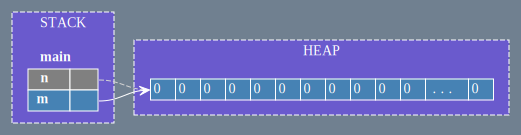

Depois a variável `m` é alocada na _stack_ e o _pointer_ de `n` é copiado para `m`:

```rust
fn main() {
    let n = Box::new(5);
    let m = n;
    .
    .
    .
}
```

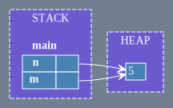

E como a _ownership_ de `n` foi transferida para `m`, o _pointee_ de `n` não é mais acessível:

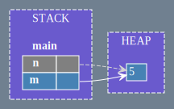

Depois a função `funcao` é chamada, criando um novo _frame_ na _stack_:

```rust
fn main() {
    let n = Box::new(5);
    let m = n;
    funcao();
}

fn funcao() {
    let x = Box::new(10);
}

```

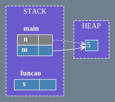

E a variável `x` é alocada na _stack_, no _frame_ da função `funcao` e o _pointee_ de `x` é alocado na _heap_:

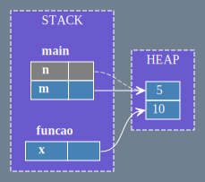

Depois a função `funcao` termina de executar e o _frame_ da função `funcao` é desempilhado:

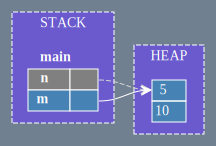

E o _pointee_ de `x` é desalocado da _heap_:


Depois a função `main` termina de executar e o _frame_ da função `main` é desempilhado, assim primeiro a variável `m` é desalocada da _stack_:

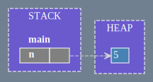

E em seguida o _pointee_ de `m` é desalocado da _heap_:

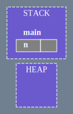

E por fim a variável `n` é desalocada da _stack_.
