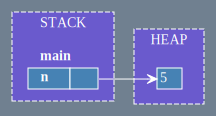

# Ownership


_Ownership_ é um conceito importante em Rust. É o que permite que Rust faça certas garantias de segurança sem a necessidade de um _garbage collector_.

## Comportamentos Indefinidos

A base do Rust é evitar comportamentos indefinidos. Comportamentos indefinidos são comportamentos que podem ocorrer em tempo de execução, mas não são garantidos. Isso pode ocorrer por diversos motivos, como por exemplo, acessar um valor que não existe na memória. Por exemplo:

```C
//C code
int main() {
    int v[3] = {1, 2, 3};
    printf("%d\n", v[100]);
    return 0;
}
```

O código acima tenta acessar o valor na posição 100 do vetor `v`, mas como o vetor só tem 3 elementos, o valor na posição 100 não existe. O que acontece quando executamos esse código? Depende do compilador. O compilador pode decidir que o programa deve ser encerrado, ou pode decidir que o programa deve continuar executando, mas com um valor aleatório na posição 100 do vetor. Isso é um comportamento indefinido. Para evitar isso certas linguagens podem usar um _garbage collector_, que é um programa que roda junto com o programa principal e que é responsável por verificar se o programa está tentando acessar um valor que não existe na memória. Se o programa estiver tentando acessar um valor que não existe na memória, o _garbage collector_ encerra o programa.

No caso de Rust para evitar o uso de um _garbage collector_, que encontra o comportamento indefinido em _run-time_, Rust encontra o comportamento indefinido em _compile-time_. Por exemplo, o código abaixo não compila:

```Rust
fn main() {
    let v = vec![1, 2, 3];
    println!("{}", v[100]);
}
```

## _Stack_ e _Heap_

Para entender como Rust encontra o comportamento indefinido em _compile-time_, precisamos entender como a memória é organizada. A memória é dividida em duas partes: _stack_ e _heap_. A _stack_ é uma pilha de memória que é organizada em ordem de alocação e desalocação. A _stack_ é usada para armazenar valores que tem um tamanho conhecido em tempo de compilação. Por exemplo, o tipo `i32` tem sempre 32 bits, então o compilador sabe que o valor `i32` sempre vai ocupar 32 bits na memória. Já o _heap_ é uma pilha de memória que é organizada de forma aleatória. O _heap_ é usado para armazenar valores que tem um tamanho desconhecido em tempo de compilação. Por exemplo, o tipo `String` pode ter qualquer tamanho, então o compilador não sabe quanto de memória deve ser alocado para armazenar um valor do tipo `String`.

Um exemplo da forma que o Rust armazena na _stack_ é:

```Rust
fn main(){
      let n = 5;
      .
      .
      .
}
```
Neste _frame_ da _stack_ o valor `5` é armazenado na stack:


Observa-se que neste frame a variável `n` é armazenada dentro da _stack_ e no _frame_ da função `main`. Quando a função `main` termina de executar, o frame é desempilhado e a variável `n` é desalocada da memória.

Agora veremos o que ocorre quando chamamos uma função que vai utilizar o valor de `n`:

```rust
fn main() {
    let n = 5;
    ... = add_one(n);
    .
    .
    .
}

fn add_one(x: i32) -> i32 {
    x + 1
}
```

Assim vemos a _stack_ após a chamada da função `add_one`:


O valor de `n` é copiado para a função `add_one` e é armazenado no _frame_ da função `add_one`. Depois disso temos:

```rust
fn main() {
    let n = 5;
    let m = add_one(n);
    .
    .
    .
}

fn add_one(x: i32) -> i32 {
    x + 1
}
```


Assim o valor retornado pela função `add_one` é copiado para a variável `m` e é armazenado no _frame_ da função `main` e o  _frame_ da função `add_one` é desempilhado e a variável `x` é desalocada da memória.

No caso de expressões que leem uma variável e escrevem em outra, como por exemplo:

```rust
fn main() {
    let n = 5;
    let mut m = n;
    m += 1;
}
```

A Stack primeiro aloca o valor de `n`:


Depois aloca o valor de `m`, copiando ele em um novo espaço:


E, por isso, quando ele some da memória, o valor de `n` não é alterado:


### _Boxes_

Observando o seguinte exemplo:

```rust
fn main() {
    let n = [0;1_000_000];
    let m = n;
}
```

Sua alocação na _stack_ seria:


Isso obviamente seria muito custoso. Por isso, uma forma do Rust acessar o dado sem ter que copiar, é com um _pointer_ que aponta para o valor (chamado de _pointee_) alocado na _heap_. A é uma região separada da memória onde o dado pode ficar indefinidamente. Os dados da _heap_ não são ligados a um _frame_ especifíco da _stack_. No Rust o _construct_ `Box` é usado para alocar um valor na _heap_. Por exemplo:

```rust
fn main() {
    let n = Box::new([0; 1_000_000]); 
    let m = n;
}
```

Assim sua alocação ficaria: TODO: o diagrama não está preciso


Quando a _construct_ `Box` é criada ela aloca um espaço na _heap_ e retorna um _pointer_ (representado por ⏺) para esse espaço. Esse _pointer_ indica onde está o _pointee_ na _heap_. Já quando `let m = n;` é executado, o _pointer_ é copiado para a variável `m` e o _pointee_ não é copiado.

#### Desalocação

Em Rust a desalocação de um valor na _heap_ é feita quando o _pointer_ sai de escopo. A partir do exemplo anterior temos: 

```rust
fn main() {
    let n = Box::new([0; 1_000_000]); 
    let m = n;
}
```

Quando a declaração `let m = n;` é executada, não apenas o _pointer_ é copiado como a _ownership_ do _pointee_ é transferida para a variável `m`. Isso significa quando a variável `n` sai de escopo, o _pointee_ é desalocado da memória. Isso é chamado de _move_.




